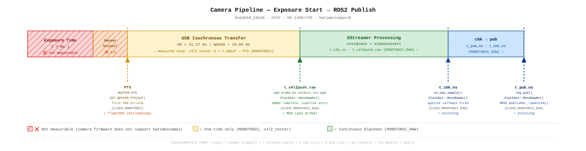

# GStreamer vs 순수 V4L2 캡처 레이턴시 비교 실험 

**날짜**: 2026-05-18  
**장치**: See3CAM_24CUG (USB UVC) on Jetson Orin NX (CTI Hadron NGX024)

---

## 1. 배경

- FAST-LIVO2 이미지 토픽 레이턴시 최소화 목적  
- 기존 HD 포맷 기준 GStreamer 병목 ~21ms 확인 (ROS2 변환 별도 ~1ms)  
- 스텝당 계산 주기(100ms)의 20%를 이미지 토픽 발행에 소비 중 — 병목 원인 규명 및 개선 필요

## 2. 방법

- GStreamer 파이프라인 vs 순수 V4L2 캡처 방식 간 레이턴시 비교  
- GST_TRACERS 로 element별 기여도 분리 측정  
- 소프트웨어 최적화 옵션(클럭 고정, USB autosuspend, 버퍼 수, io-mode 등) 효과 실측  
- V4L2 버퍼 타임스탬프 출처(SOE/EOF), `hwtimestamps` 파라미터 영향 확인

## 3. 결론 요약

| 캡처 방식 | 조건 | latency |
|---|---|---|
| GStreamer SD UYVY (1280x720→640x360) | 기본 | 18.1 ms |
| GStreamer SD UYVY | jetson_clocks + autosuspend off | **16.4 ms** |
| 순수 V4L2 UYVY (bufs=2) | DQBUF only | **11.37 ms** |
| 순수 V4L2 UYVY (bufs=2) | DQBUF + swscale | 16.03 ms |
| 순수 V4L2 MJPG (bufs=2) | DQBUF only | **6.45 ms** |

**결론**:  
- PTS 플래그는 SOE로 표시되나 `hwtimestamps=0`이므로 실제 값은 **첫 번째 URB 도착 시각** (USB 전송 시작)  
- 11.37ms = USB 전송 시간 — 기존 추론 **유효**  
- jetson_clocks + autosuspend off 로 1.7ms 절감 (18.1 → 16.4 ms)  
- 이후 blackbox RAW 구현: `t_v4l2push_raw` (pad probe) 추가로 GStreamer 처리 구간 독립 측정 가능

---

## 4. 환경

| 항목 | 값 |
|---|---|
| 보드 | Jetson Orin NX 16GB / CTI Hadron (NGX024) |
| OS / 커널 | L4T R36.4.4 / 5.15.148-tegra |
| ROS 2 | Humble |
| 카메라 | See3CAM_24CUG (USB 3.0, UVC) |
| GStreamer | 1.20.3 |
| 해상도 (GST) | 1280x720 캡처 → 640x360 출력 (SD) |
| 픽셀 포맷 | UYVY (기본), MJPG (비교용) |
| uvcvideo 옵션 | nodrop=1, hwtimestamps=0 (기본값) |
| 클럭 모드 | 기본 / jetson_clocks + autosuspend off 비교 |

## 5. 측정 방법

- **pipeline_tester**: GStreamer appsink 콜백 기준 `now_rt − BUFFER_PTS`, 100 샘플, 워밍업 5프레임  
- **GST_TRACERS**: `latency(flags=element)` — element별 처리 시간 분리  
- **v4l2_tester**: 순수 V4L2, `VIDIOC_DQBUF` 직후 `mono_ns() − PTS`, bufs=2 강제, 100 샘플, 워밍업 5프레임  
- 측정 지표: 평균 레이턴시, p99 (최대 스파이크 관찰)

**파이프라인 타임라인 및 측정 가능 구간**:

**타임스탬프 출처 확인 (DQBUF flags 직접 측정)**:

| 항목 | 값 |
|---|---|
| DQBUF flags | `0x00012041` |
| TSTAMP_SRC (`& 0x00070000`) | `0x00010000` = `V4L2_BUF_FLAG_TSTAMP_SRC_SOE` |
| 타임스탬프 도메인 | `CLOCK_MONOTONIC` |
| uvcvideo hwtimestamps | **0** (기본값 — 카메라 hardware PTS 미사용) |
| **실제 PTS 의미** | **첫 번째 URB 도착 시각** (USB 전송 시작) |

→ `hwtimestamps=0` 상태에서 SOE 플래그는 표시되나 실제 값은 software timestamp  
→ `hwtimestamps=1` 테스트 결과: 측정값 변화 없음 — 카메라 firmware가 hardware timestamp 미지원 확인

## 6. 실험 결과

### GStreamer element별 레이턴시 (GST_TRACERS, SD 기준)

| Element | latency |
|---|---|
| v4l2 커널 큐 추정값 (전체 − element 합산) | ~11.8 ms |
| nvvidconv | 5.0 ms |
| videoconvert | 1.3 ms |
| **전체** | **18.1 ms** |

### 최적화 조건별 비교

| 방식 | 조건 | mean latency | p99 |
|---|---|---|---|
| GST SD UYVY | 기본 | 18.1 ms | — |
| GST SD UYVY | jetson_clocks + autosuspend off | 16.4 ms | — |
| V4L2 UYVY | DQBUF only, bufs=2 | 11.37 ms | 11.45 ms |
| V4L2 UYVY | DQBUF + swscale, bufs=2 | 16.03 ms | 16.16 ms |
| V4L2 MJPG | DQBUF only, bufs=2 | 6.45 ms | 6.49 ms |

### kernel bufs 효과

| 조건 | mean latency | p99 |
|---|---|---|
| bufs 기본값(4) | 11.37 ms | 66 ms |
| bufs=2 강제 | 11.37 ms | 11.5 ms |

### USB 전송 시간 (v4l2_tester A 측정, 해상도별)

| 해상도 | 프레임 크기 | USB 전송 (mean) |
|---|---|---|
| HD 1280×720 | 1.84 MB | 11.37 ms |
| WUXGA 1920×1200 | 4.42 MB | 16.94 ms |

## 7. 분석

- **PTS 실체 확인**: `hwtimestamps=0` → PTS = 커널이 첫 번째 URB를 받은 시각 (CLOCK_MONOTONIC, software). SOE 플래그는 카메라가 보고하는 UVC 헤더 기반이나 timestamp 값 자체는 software  
- **11.37ms = USB 전송 시간**: `PTS(첫 URB) → DQBUF(마지막 URB)` = 프레임 전체 USB 전송 소요 시간. 기존 추론 유효  
- **hwtimestamps=1 검증**: 측정값 변화 없음 → 카메라 firmware가 정확한 SCR/PTS 미제공. hardware SOE 측정 불가  
- **GStreamer 오버헤드**: nvvidconv(5.0 ms) + videoconvert(1.3 ms) = 6.3 ms — `t_v4l2push_raw`(pad probe) 기준으로 독립 측정 가능  
- **jetson_clocks 효과**: element 처리 시간 단축 주 원인 (nvvidconv 6.0→5.2 ms, videoconvert 4.7→1.9 ms)  
- **kernel bufs=2**: 평균 무변화, p99 66→11.5 ms — 스파이크 제거 효과만 유효

## 8. 시도했으나 효과 없던 것

- **appsink max-buffers 축소(2개)**: 18.1→18.2 ms (무효)  
  → appsink 버퍼와 v4l2 커널 큐는 독립적 레이어. 영향 없음  

- **io-mode=dmabuf**: 18.4 ms (무효)  
  → UVC 드라이버에서 dmabuf zero-copy 미지원  

- **low_latency_mode**: See3CAM_24CUG 미지원  
  → `v4l2-ctl --list-ctrls` 결과 해당 컨트롤 없음  

- **10fps 전환**: DQBUF-only 11.37 ms 유지 (무효)  
  → USB 전송 시간은 fps가 아닌 프레임 데이터 크기에 비례  

- **kernel bufs=2 강제 (평균 기준)**: 평균 변화 없음  
  → p99 개선(66→11.5 ms)만 확인  

- **jetson_clocks + autosuspend off (5ms 목표 기준)**: 16.4 ms — 목표 미달  
  → USB 전송 시간(~11.4 ms)이 구조적 하한  

- **hwtimestamps=1**: 측정값 변화 없음  
  → 카메라 firmware가 hardware timestamp 미지원

## 이론적 물리적 한계

USB 3.1 Gen 1 기준 이론 전송 시간:

| 포맷 | 프레임 크기 | 실측 (mean) |
|---|---|---|
| HD UYVY (1280×720) | 1.84 MB | 11.37 ms |
| WUXGA UYVY (1920×1200) | 4.42 MB | 16.94 ms |

## 9. 향후 과제

- **노출 시간 측정**: `v4l2-ctl --get-ctrl=exposure_time_absolute` — 현재 auto exposure 상태, 고정 노출로 전환 후 정확한 값 확인 필요  
- **blackbox RAW 측정 운영**: `t_v4l2push_raw`(pad probe) 추가 완료. `t_cbk_ns − t_v4l2push_raw` = GStreamer 처리 구간 지속 모니터링  
- **USB 대역폭 실측**: `usbmon`으로 실제 isochronous throughput 검증  
- **MJPG + GPU 디코드**: DQBUF 6.45 ms + GPU 디코드 시간 미측정 — 실측 필요
